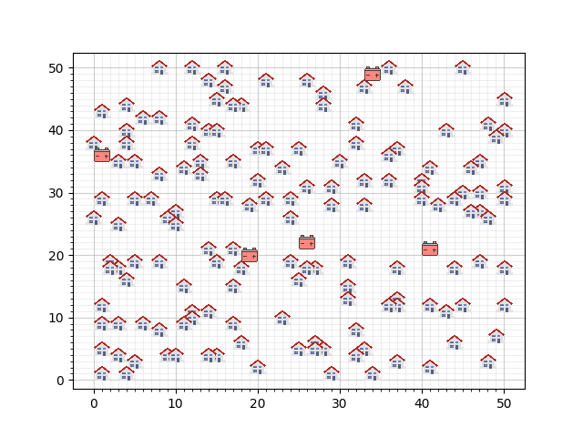
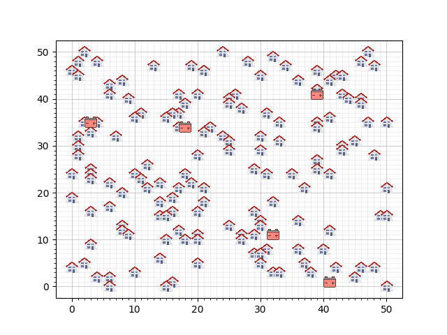

# Smartgrid project

## Introductie case
Het probleem in deze case gaat over een gebied met huizen die zonnenpanelen hebben geinstalleerd. Elk van deze huizen
kan meer produceren dan het verbruikt, en deze energie willen we opslaan in batterijen. Er zijn een aantal batterijen
geplaatst in het gebied en we willen elk huis verbinden aan een batterij. De taak is om alle huizen te verbinden, met
het gebruik van zo min mogelijk kabels, want elk stukje kabel kost geld (9 euro per rooster-segment). De case hebben
we onderverdeeld in twee gevallen. Een simpelere en een complexere uitbreiding daarvan.

### Simpeler geval
Elk huis heeft een maximale productie, en elke batterij heeft een maximale capaciteit. Een van de constraints van dit
probleem is dat de capaciteit van de batterij niet overschreden wordt. Dat betekent dat de maximale productie van alle
huizen die verbonden zijn aan een batterij samen niet de groter mogen zijn dan de capaciteit van die batterij.

Kabels mogen in dit simpelere geval niet gedeeld worden, maar ze mogen wel op dezelfde rooster-segmenten lopen.

### Meer uitgebreid geval
Dit geval is een uitbreiding van het simpelere geval. De uitbreiding is dat het toegestaan is om kabels te delen. De
batterijen kunnen nog steeds niet met elkaar verbonden worden, ookal kunnen kabels van de ene batterij wel door een
andere batterij heen gaan.

### Het project
Wij hebben algoritmes geschreven voor beiden gevallen (kabels delen, en kabels niet delen). Verder hebben we ook drie
gebieden meegekregen waarop we de algoritmes moesten toepassen. De drie gebieden zien er als volgt uit:

   

## Vereisten
In requirements.txt staan alle packages die nodig zijn om onze code succesvol te kunnen draaien. De packages kunnen
geinstalleerd worden met het volgende command:
```
pip install -r requirements.txt
```

## Gebruik
Het programma wordt gestart met het volgende command:
```
```
Vervolgens

## Structuur
Onze structuur staat schematisch weergegeven in de volgende afbeelding:

Alle code wordt geedraait vanuit main.py. Hierin staat de user-interface (zie Gebruik). We zullen nu kort elk bestand
en elke folder toelichten:

### classes
In deze folder staan alle klassen die wij gebruiken (die geen algoritmen zijn). De bestanden in deze folder zijn:

#### __init__.py
Dit bestand is leeg, maar is nodig om het importeren succesvol te laten verlopen.
#### battery.py
#### cable.py
#### configuration.py
#### house.py
#### map_lists.py

### algorithms
In deze folder staan alle algoritmes die wij gebruiken om huizen onder te verdelen in batterijen. De bestanden in deze
map zijn:

#### cable_algorithm.py
This file contains the Cable class, which is used to lay cables to connect houses with batteries inside the grid.
#### greedy_algorithm.py
Greedy class contains a collection of greedy algorthms to distribute the houses amoung the batteries inside
a configuration.
#### hill_climber.py
...
#### optimum_deluxe.py
#### random_algorithm.py
#### simulated_annealing.py

### results
Hier worden resultaten in json bestanden opgeslagen. Zie voor verdere beschrijving de readme in results.

### visualization
#### algorithms.py
#### check50_to_visualization


## Auteurs
Ruben van Oostenbrugge, Olaf Vrijmoet en Sam Ritchie

Gebruik:
In Algorithms.py kun je verschillende heuristieken vinden oplossingen voor de case te vinden. Individuele heuristieken gebruiken verschillende combinaties van algorithms om de huizen te verdelen in de batterijen en om kabels aan te leggen om deze aan te sluiten. De verschillende oplossingen voor onze case worden aangeslagen in main.py

Structuur:

Het Optimum prime project heeft sorten mappen: algorithms en classes. The algorithms map heeft een verzameling van alle algoritmes die wij toepassen op het project. De classes organiseert de data types die wij gebruiken. Hieronder een korte beschrijving van de content van elke file:

algorithms/cable_algorithm.py:
Cable:
- Neemt configuration class in
- cable_listbatteries: loopt door een lijst met batterijen heen en roept connect_batty_houses. - Input - lijst met batterijen en booling (True kabels delen, False niet kables delen)
- connect_battery_houses: roept het juste algoritme opbasis van de kabels delen constraint. - Input - 1 batterij en booling (True kabels delen, False niet kables delen)
- connect_points_Astar: sluit twee punten met elkaar met het begruik van een kabel - Input - een start punt en een eind punt (objecten met position_x en position_y) -- Output - een type Cable_line() gevult met een lijst aan Cable_instance()'s.
- calculate_distance: Rekent de afstand uit tussen twee punten - Input - een start punt en een eind punt (objecten met position_x en position_y) -- Output - een int met de directe afstand.
- connecting_cables: Neemt het eerste huis in de lijst en kijkt welke huizen er in een aangegeven radius om dat huis heen zijn. Rekent het midden punt uit van deze groep huizen en legt dan een kabel van dat punt naar de batterij en vervogens legt hij een kabel van alle huizen naar dat punt en sluit deze kabels aan de gedeelde kabel naar de batterij. - Input - een lijst met huizen, een batterij, en de radius -- Output - Een lijst met alle nieuwe kabels van type Cable_line() gevult met een lijst aan Cable_instance()'s.

greedy_algorithm.py
Greedy()::
- Neemt een


De hierop volgende lijst beschrijft de belangrijkste mappen en files in het project, en waar je ze kan vinden:

/assignment1: bevat alle code van dit project
/assignment1/algorithms: verzameling van de code voor algoritmes
/assignment1/classes: verzameling van de vier benodigde classes voor deze case en de informatie voor de kaarten

