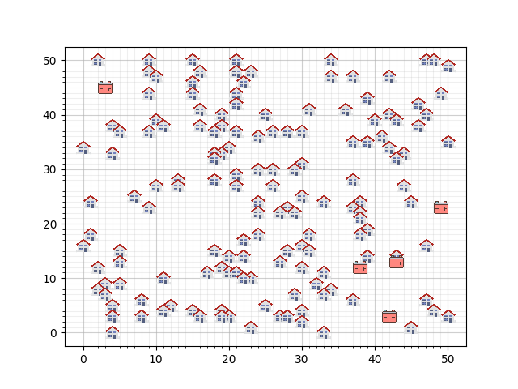

# Smartgrid project

## Introductie case
Het probleem in deze case gaat over een gebied met huizen die zonnenpanelen hebben geinstalleerd. Elk van deze huizen
kan meer produceren dan het verbruikt, en deze energie willen we opslaan in batterijen. Er zijn een aantal batterijen
geplaatst in het gebied en we willen elk huis verbinden aan een batterij. De taak is om alle huizen te verbinden, met
het gebruik van zo min mogelijk kabels, want elk stukje kabel kost geld (9 euro per rooster-segment). De case hebben
we onderverdeeld in twee gevallen. Een simpelere en een complexere uitbreiding daarvan.

### Simpeler geval
Elk huis heeft een maximale productie, en elke batterij heeft een maximale capaciteit. Een van de constraints van dit
probleem is dat de capaciteit van de batterij niet overschreden wordt. Dat betekent dat de maximale productie van alle
huizen die verbonden zijn aan een batterij samen niet de groter mogen zijn dan de capaciteit van die batterij.

Kabels mogen in dit simpelere geval niet gedeeld worden, maar ze mogen wel op dezelfde rooster-segmenten lopen.

### Meer uitgebreid geval
Dit geval is een uitbreiding van het simpelere geval. De uitbreiding is dat het toegestaan is om kabels te delen. De
batterijen kunnen nog steeds niet met elkaar verbonden worden, ookal kunnen kabels van de ene batterij wel door een
andere batterij heen gaan.

### Het project
Wij hebben algoritmes geschreven voor beiden gevallen (kabels delen, en kabels niet delen). Verder hebben we ook drie
gebieden meegekregen waarop we de algoritmes moesten toepassen. De eerste van de drie gebieden ziet er als volgt uit:



## Vereisten
In requirements.txt staan alle packages die nodig zijn om onze code succesvol te kunnen draaien. De packages kunnen
geinstalleerd worden met het volgende command:
```
pip install -r requirements.txt
```

## Gebruik
Het programma wordt gestart door het volgende commando in te voeren:
```
python3 __main__.py
```
Vervolgens gebeuren de volgende stappen in volgorde:
- Je kiest met welke district je wilt werken (1, 2 of 3)
- Je kiest welk probleem je wilt gebruiken: kabels delen of niet
- Je kiest welk algoritme je wilt gebruiken
- Je krijgt het resultaat met een visualisatie te zien
- Je krijgt ook de optie om het resultaat in het results-mapje op te slaan

## Structuur
Alle code wordt geedraait vanuit __main__.py. Hierin staat de user-interface (zie Gebruik hierboven). We zullen nu kort elk bestand
en elke folder toelichten:

## Notatie
Conform wiskundige consensus, worden de letters 'i','j' en 'k' als indices gebruikt. 

### classes
Deze folder organiseert de data-types die wij gebruiken in ons project. De bestanden in deze folder zijn:

#### __init__.py
Dit bestand is leeg, maar is nodig om het importeren succesvol te laten verlopen.

#### battery.py
De batterij-klasse slaat alle belangrijke informatie op naar de batterij in de configuratie en het bevat een verzameling
functies die die informatie kunnen veranderen. Initialisatie vereist een x- en een y-coordinaat en de capaciteit van de
batterij

#### cable.py
Dit bestand bevat twee klassen:
##### Cable_instance class
Een Cable_instance object bevat de coordinaten, de volgende en de vorige kabel instantie in een kabel en andere informatie
over een punt in de kabel. Verder bevat de klasse een functie met betrekking tot de kabel-punt. Initialisatie vereist de x-
en y-coordinaten binnen een district.

##### Cable_line
Een Cable_line object bevat de eerste Cable_instance, de laatste Cable_instance en een lijst met alle Cable_instance's in
een kabel. Verder bevat het ook meer informatie over de kabel en een collectie van functies met betrekking tot de kabels
in de configuratie.

#### configuration.py
---?


#### house.py
De House klasse slaat alle informatie over een huis in een configuratie op. Intialisatie vereist een x-,y-coordinaat en
de maximale productie van het huis.

#### map_lists.py
Dit bestand bevat de districts 1, 2 en 3 zoals benoemd in https://theorie.mprog.nl/cases/smartgrid. Er is ook een 4e
district om mee te testen.

### algorithms
In deze folder staan alle algoritmes die wij gebruiken om huizen onder te verdelen in batterijen. De bestanden in deze
map zijn:

#### cable_algorithm.py
Bevat een Cable klasse. Deze klasse bevat een algoritme die kabels neerlegt tussen punten binnen een configuratie.
Deze klasse wordt geinitialiseerd met een configuratie object. Waarna de cable_list_batteries aangeroepen wordt.
Deze itereert door de batterijen, die al gevuld zijn met huizen. De huizen in de batterijen worden verbonden mbv
een kabel. Deze kabels worden opgeslagen in de all_cables variabele in de configuration object.

Initialisatie vereist een configuratie object

#### greedy_algorithm.py
De Greedy klasse is een verzameling van algoritmes die huizen verdeelt huizen, samen met functies die dit ondersteunen.
De klasse wordt gebruikt door een greedy functie in de klasse aan te roepen: proximity_sort of random_greedy. Deze
algoritmes verdelen de huizen in batterijen in de configuratie object, en vervolgens werken ze ook de batterijen bij
met hun nieuwe huizen.

Initialisatie vereist een configuratie van een district.

#### hill_climber.py
We initialiseren deze klasse met een configuratie object die al een correcte oplossing is voor het probleem. Vervolgens
kunnen we de functie clim_the_hill aanroepen om een aantal stappen te nemen in de richting van een lokaal minimum. Elke
stap is of twee huizen omwisselen, of een huis een nieuwe batterij geven. Als de stap voor een slechtere of incorrecte
oplossing zorgt, wordt de stap ongedaan gemaakt, en gaan we naar de volgende stap.

#### optimum_deluxe.py
Optimum_deluxe optimaliseer met gedeelde kabels, door de huizen te verbinden aan de goedkoopste batterij (greedy). Dan
gebruikt het hill-descent van de batterij capaciteit overschrijding, door de huizen iteratief te herlocaliseren (de
herlokalisering die gedaan wordt, is diegene die resulteert in de grootste afdaling van batterij capaciteit
overschreiding per extra euro kosten) en als het programma niet meer verder kan, wordt hetzelfde gedaan met huizen
verwisselen in plaats van alleen herlokaliseren.

#### random_algorithm.py
In dit bestand zijn de algoritmes: Random_house_sort en Battery_capacity_hill_decent. De eerste algoritme geeft een
compleet willekeurig resultaat (die aan de constraints voldoen), en de tweede verbind elk huis met de dichtsbijzijnste
batterij, waarna iteratief de capacteit overschrijding van de batterijen naar nul wordt gebracht mbv hill descent.

#### simulated_annealing.py
De simulated_annealing klasse bevat alle functies om de simulating annealing algoritme uit te kunnen voeren. Het algoritme
rekent de energie uit die het kost om een huis te verplaatsen weg van zijn huidige batterij, naar een willekeurig ander
batterij. Deze energie kosten wordt uitgerekend op basis van de volheid van de batterij waarnaar het huis verplaatst zou
worden samen met de afstand van die batterij tot het huis. De energie van het systeem zal over tijd kleiner worden,
waarbij stappen die de energie verhogen over tijd steeds minder vaak voorkomen. Dit algoritme exploreert meerdere minima,
en zal daardoor dichterbij het absolute minimum kunnen komen.

De initialisatie vereist een configuratie object van een district.

### results
Hier worden resultaten in json bestanden opgeslagen. Zie voor verdere beschrijving de readme in results.

### visualization
In deze map worden algoritmes gebruikt en gecombineerd om ze te kunnen visualiseren.

#### algorithms.py
Dit bestand bevat de Combining_algorithms klasse. Deze klasse bevat verschillende functies die twee algoritmes
combineren. In de meeste gevallen is de combinatie van de vorm: Een algoritme om de huizen te verdelen onder de
batterijen, en een algoritme om de kabels aan te leggen. In een enkel geval is de combinatie van de vorm: Een algoritme
om de huizen te verdelen in de batterijen, en een algoritme om vervolgens iteratief die oplossing proberen te verbeteren.

De initialisatie vereist het nummer van de district waarmee gewerkt wil worden.

#### check50_to_visualization,.py
De Check50_to_visualization klasse initialisatie vereist een json bestand die een oplossing bevat in de vorm van de check50 input. We gebruiken pyplot
om een officieel uitziende visualizatie te creeren.

Deze klasse maakt een visualisatie van alle huizen, batterijen en kabels.

## Auteurs
Ruben van Oostenbrugge, Olaf Vrijmoet en Sam Ritchie

